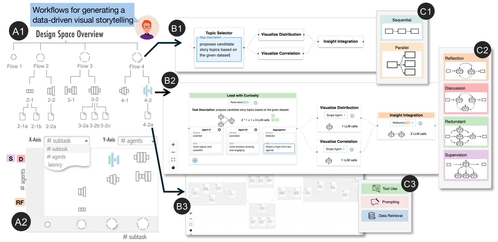

# FlowForge: Guiding the Creation of Multi-agent Workflows with Design Space Visualization as a Thinking Scaffold

Docs are available at 
https://visual-intelligence-umn.github.io/FlowForge/



## Online Demo: [Play with FlowForge](https://vis-flow-forge-demo.vercel.app)


## Installation

If running for the first time, install dependencies (nodejs version 18 or newer):
```bash
npm install # or `pnpm install` or `yarn install`
```
To run server:
```bash
npm run dev
```

To enable API locally: 

Make a copy of `.env_sample` and rename it to `.env`. Replace the placeholders with your actual API keys.

Following API keys are used in the current version:

- `VITE_OPENAI_API_KEY` OpenAI as LLM provider, please refer to [OpenAI API](https://openai.com/index/openai-api/) for more info.
- (Optional) `VITE_TAVILY_API_KEY` Tavily as search engine, and you can get an API key by visiting [this site](https://app.tavily.com/sign-in) and creating an account.  This is only needed if you plan to enable the search tool for agent.


<!-- ## Repo Rename Options

- **DivergiFlow**: reflecting diverse and branching workflow possibilities. 
- **MetaFlow**: implying the workflow building process contains meta-level abstraction (task decomposition and design pattern).
- ... -->
<!-- 
## Things to try:

- Create a new custom node inside `src/nodes/` (don't forget to export it from `src/nodes/index.ts`).
- Change how things look by [overriding some of the built-in classes](https://reactflow.dev/learn/customization/theming#overriding-built-in-classes).
- Add a layouting library to [position your nodes automatically](https://reactflow.dev/learn/layouting/layouting) -->

<!-- ## Resources

Links:

- [React Flow - Docs](https://reactflow.dev)
- [LangGraphJS - Docs](https://github.com/langchain-ai/langgraphjs) -->


<!-- - [React Flow - Discord](https://discord.com/invite/Bqt6xrs) -->

<!-- Learn:

- [React Flow – Custom Nodes](https://reactflow.dev/learn/customization/custom-nodes)
- [React Flow – Layouting](https://reactflow.dev/learn/layouting/layouting) -->
